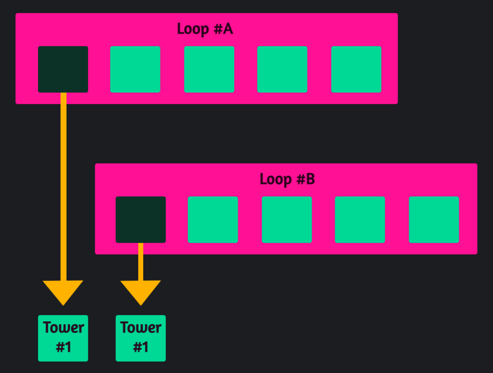
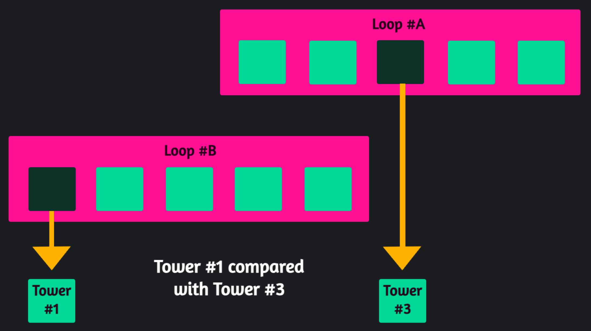
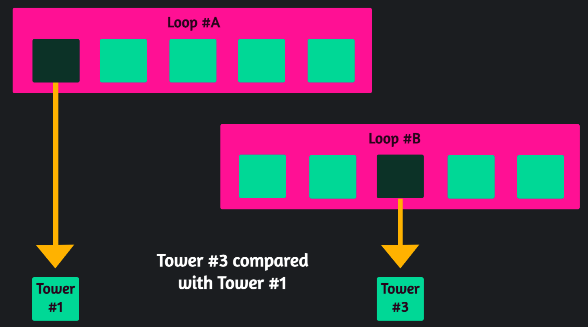
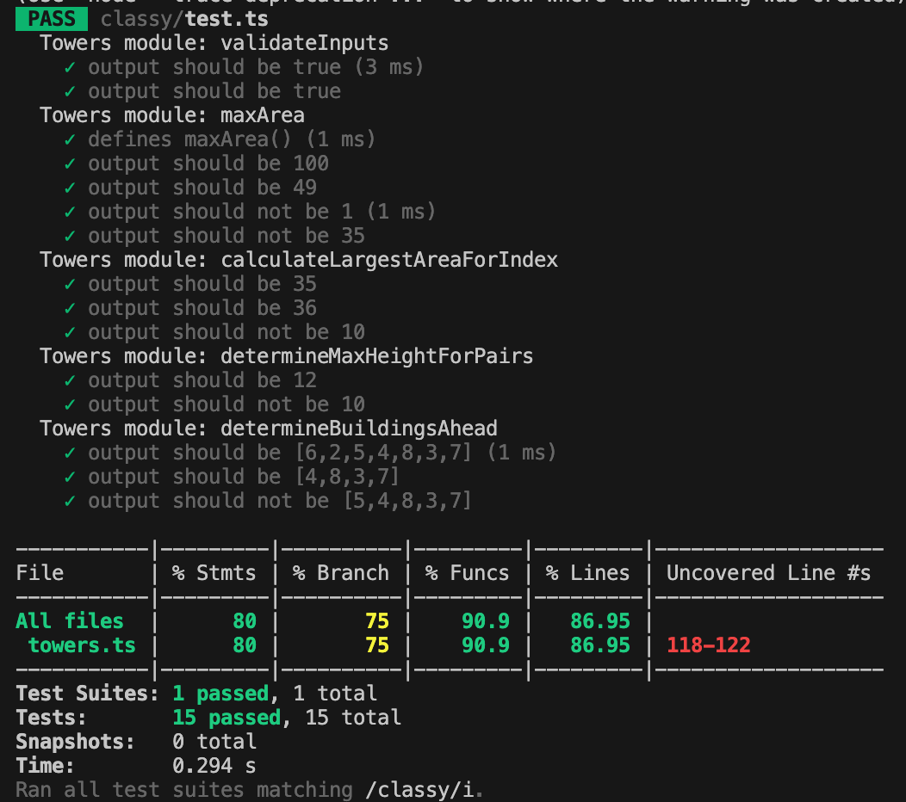

# Calculating the Maximum Possible Area Between Towers

The solution demonstrates :-
- Awareness of the need to keep functions small, and focused. (Single Responsibility Principle of SOLID.)
- A Class has been built to show awareness of OOP (Object-Oriented Programming.) Was tempted to throw in some Functional Programming, but I fear I have already gone way beyond what you were looking for.
- Awareness of arrow functions.
- Use of TypeScript types for definition of variables, function parameters, and function returns.
- Error handling.
- Asynchronous programming.
- Use of Jest for unit testing, including ``describe`` sections, etc.. Was tempted to add some mocks, to show my experience, but again, I think that is ot of scope of this exercise.

 **Table of content:** 
 - [Exercise](#exercise)
 - [The Approach](#approach)
 - [Solution Implementation #1](#solution-one)
 - [Solution Implementation #2](#solution-two)
 - [Run App](#run)
 - [Unit Tests](#tests)

**There are two sets of files:**

<a id="exercise"></a>

## Exercise: Planning an impressive stunt

Imagine you are a daredevil looking to walk a tightrope between two buildings. Your goal is to figure out how you can traverse the largest (and most impressive) area between the available buildings in your city.


For this exercise, the downtown area is represented by an integer array. The individual buildings are the elements in the array and have a different heights. 

Thus, you are given an array of integers called `height` of length `n`. There are `n` vertical lines (i.e., buildings) such that the range of the `ith` line is between `(i, 0)` and `(i, height[i])`.

Your objective is to span a tightrope between two buildings where the area encompassed below your rope has the largest area. You'll need to find the two lines in the array that together with the x-axis form a rectangle, such that the rectangle has the largest area. Only then will your crowd of onlookers be impressed.

Write a function to return the maximum area of air that you could traverse on the tightrope.

You can't move the buildings, so you can't tilt or re-orient the rectangle. If there's a tall building in your way, you can open a window on both sides and span the rope through the building. 

**Concerns**

- I am not informed of any unit tests that will be run by the person reviewing this code, but it is a fair assumption that the ``maxArea`` function will be called, so I cannot change it, including the names of the parameters. However, the parameter ``height`` has a most misleading name. The name implies it is a single item, but it is an array. I'd prefer to rename it to something that provides clarity, such as ``towerHeights``.

- The word 'endpoints' is used to refer to an array range. The word is usually understood to define REST API paths.

**Example A**


```
Input: height = [1,8,6,2,5,4,8,3,7]
Output: 49
Explanation: The vertical lines are represented by array [1,8,6,2,5,4,8,3,7]. Here the max area (blue section) you can traverse is 49.
```

**Example B**

```
Input: height = [1,1]
Output: 1
```

**Constraints**

```
2 <= n <= 105
n == height.length
0 <= height[i] <= 104
```

<a id="approach"></a>

## The Approach

Effectively, one can achieve the result by looping over the towers in ``[1,22,5,4,8,3,20]`` and for each tower, comparing it to the other towers, to find the pair between which falls the greatest area. However, while that solution may give the response you wish for, it is rather crude.

**We can make the algorithm more efficient:**

***Not measuring tower against itself:*** Let's imagine we receive the first item in the first loop, let's call it Tower #1. Now, as the second loop presents each tower, it is also going to give us Tower #1 to make calculations against.  There is no utility in calculating the area between Tower #1 and itself, as this would defy the laws of physics and basic mathematics.

***Not measuring the same area twice*** This is another area of possible 'duplication of effort'.  For example, as one has considered Tower #1 (from first loop) against Tower #3 (from second loop), there is no need to now consider the same pairing of towers again as Tower #3 (from first loop) against Tower #1 (from second loop.) 

***Forwards only:*** We can avoid complexity, and address both of these inefficiencies with one rule. We only consider foward from the currently presented item in the first loop. We never compare it to a tower before it. I achieved this by splicing the array (with cloning to avoid mutation) with the index of the item presented from the first loop. The spliced array presents only the items ahead of the index. These are then looped over as the second loop to present buildings that may in turn be considered as pairs with that currently presented from the first loop.

**Nb.** I was tempted to throw in an Angular UI, more for my own desire to build things, but that's beyond the scope for the test.

<a id="solution-one"></a>

## Solution Implementation #1: Repl folder (Methods written in TypeScript)

***What you are looking for:***

Code to run in Repl, but not saved there, because then other candidates can see my response. There is an arrow on the right of the Fork button that would reveal the responses of candidates. Privacy is only available if the candidate purchases software, while GitHub can achieve all we need.

**To run on Repl**
Copy and paste to the Repl instance.

**Run on local machine CLI**
I pasted the following to the end of the ``.ts`` file:
```
let height: number[] = [1,8,6,2,5,4,8,3,7];
console.log(maxArea(height));
```
Thus, the ``height`` values were within the file itself.
I then ran this with: ``npx tsc repl_towers.ts && node repl_towers.js``.

Other arrays can be utilised, for example ``[1,22,5,4,8,3,20]`` will give the output ``100``.

<a id="solution-two"></a>

## Solution Implementation #2: Classy folder (TypeScript Class module, and Jest tests)

Here, the logic is presented as a class, exported as a module, and [Jest](https://jestjs.io/) tests are run against it.

I could take this implemntation of Node further, and set up a server with Express to run on localhost, but I have gone beyond the remit of your exercise, and must consider other such tests that I have been sent, so will restrain my enthusiasm.

<a id="run"></a>

## Run App

**Setup (Dependencies)**

``node install`` to install the dependencies in the ``package.json``

**Build**

Converts the TS files to JS (run from the project root):
``npx tsc classy/towers.ts & npx tsc classy/exercise.ts``

**Run the Exercise**

(Run from the project root):
``node classy/exercise``

<a id="tests"></a>

## Unit Tests (Jest)

I believe testing is crucial to avoid Production issues, so I wrote unit tests that implement the Jest library. Babel was utilised for Jest to read the TypeScript file and Typescript types. (The tests are run against the ``.ts`` file.)
- These feature both negative and positive test scenarios, and a range of options.
- These test small, focused functions/methods that have a Single Responsibility (SOLID.)

In the Repl exercise, the ``package.json`` states:
``"test": "echo \"Error: no test specified\" && exit 1"``

The Repl setup uses a native ECMAScript module configuration file, which is only supported when running Babel asynchronously. Therefore, the following line was removed from ``package.json``: 
``"type" : "module"``

***Test Results***



To run the Jest tests, either:
- From the root: ``npm test classy``
- From the ``Classy`` folder: ``npm test``
